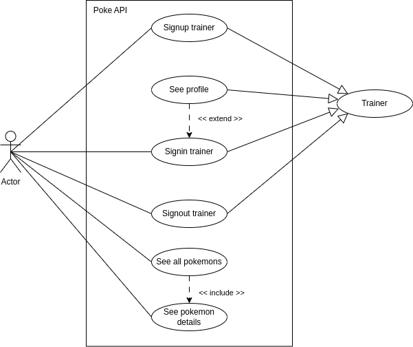
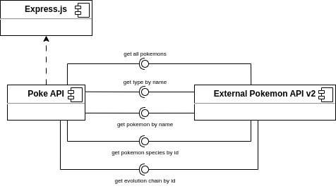
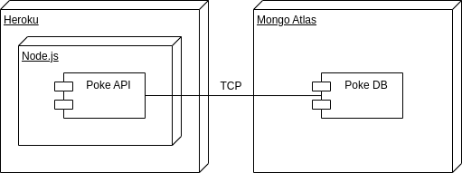

<p align="center"></p>

# Poke API


## Table of contents

- [Poke API](#poke-api)
  - [Table of contents](#table-of-contents)
  - [Project description](#project-description)
    - [Features](#features)
    - [Architecture](#architecture)
      - [Use case diagram](#use-case-diagram)
      - [Component diagram](#component-diagram)
      - [Deployment diagram](#deployment-diagram)
    - [Endpoints](#endpoints)
    - [MongoDB documents structure](#mongodb-documents-structure)
  - [User guide](#user-guide)
  - [Requeriments](#requeriments)
  - [Install guide](#install-guide)
  - [Comments](#comments)
  - [License](#license)
  - [Author](#author)

## Project description

Poke API is a comprehensive RESTful API designed to provide detailed information about Pokémon. It offers a wide range of data, including but not limited to, Pokémon characteristics, abilities, and statistics. This API is perfect for developers building applications that require Pokémon data.

### Features
- Comprehensive Pokémon Data: Access detailed information on Pokémon species, abilities, moves, and types.

### Architecture

#### Use case diagram



#### Component diagram



#### Deployment diagram



### Endpoints

```
* Auth:
  * POST /api/v1/auth/signup
  * POST /api/v1/auth/signin
  * GET /api/v1/auth/signout
  * GET /api/v1/auth/me
* Pokemon:
  * GET /api/v1/pokemon
  * GET /api/v1/pokemon/:name
```

### MongoDB documents structure

- Trainer:
  - email: string,
  - name: string,
  - nickname: string,
  - password: string,
  - team: string
  - createdAt: date
  - lastConnection: date

## User guide

Describe the project structure and how to use it.

```bash
.
├── docs
│   ├── assets
│   │   ├── diagrams
│   │   │   ├── component.png
│   │   │   ├── deployment.png
│   │   │   ├── usecase.png
│   │   ├── pokelogo.png
│   └── poke-api-doc-v1.json
├── ecosystem.config.js
├── jest.config.ts
├── LICENSE
├── nodemon.json
├── package.json
├── README.md
├── src
│   ├── app.ts
│   ├── config
│   │   ├── config.ts
│   │   ├── logger.ts
│   │   └── morgan.ts
│   ├── constants
│   │   └── responses.ts
│   ├── controllers
│   │   ├── auth.controller.ts
│   │   └── pokemon.controller.ts
│   ├── entities
│   │   └── Trainer.ts
│   ├── index.ts
│   ├── interfaces
│   │   ├── pokemon.ts
│   │   └── trainer.ts
│   ├── middlewares
│   │   ├── error.ts
│   │   ├── hashing.ts
│   │   ├── rateLimiter.ts
│   │   ├── token.ts
│   │   └── validate.ts
│   ├── routes
│   │   └── v1
│   ├── services
│   │   ├── pokemon.service.ts
│   │   └── trainer.service.ts
│   ├── utils
│   │   ├── ApiError.ts
│   │   ├── jwt.ts
│   │   ├── pick.ts
│   │   └── pokemon.ts
│   └── validators
│       ├── auth.validator.ts
│       └── pokemon.validator.ts
├── tests
│   ├── integration
│   │   ├── auth.spec.ts
│   │   └── pokemon.spec.ts
│   ├── unit
│   │   ├── entities
│   │   └── middlewares
│   └── utils
│       └── setupTest.ts
└── tsconfig.json

```

To see the documentation must be run the application in development mode and open this link [documentation](http://localhost:3000/api/v1/docs/)

Link to demo [here](https://awesomepokeapi-ae9d4e3e043d.herokuapp.com/)

## Requeriments

- Node.js version 18 or higher [Node.js](https://nodejs.org/en/)
- NPM version 8 or higher [NPM](https://www.npmjs.com/)
- MongoDB version 4 or higher [MongoDB](https://www.mongodb.com/)

## Install guide

Below are the instructions to install and run the project en development mode.

```bash
git clone https://github.com/christophermontero/pokeapi.git
cd pokeapi
npm install
npm run dev
```

## Comments

If you have any feedback, please reach out at cgortizm21@gmail.com

## License

This project is under [Apache License](https://www.apache.org/licenses/LICENSE-2.0).

## Author

[@christophermontero](https://github.com/christophermontero)
